# Novel Writer Prototype — Walkthrough

> 版本：Phase B / v0.1 MVP prototype（2026-05-12）
> 對應 code：`F:\workspace\novel_writer\apps\web\`
> 截圖：`docs/prototypes/screenshots/`（Playwright 1440×900 自動截圖）
> 目的：讓使用者走過完整 MVP 主流程、驗收 UX 是否合理，然後回饋「哪裡要改、哪裡 OK」再進入實作軌。

---

## 啟動

```powershell
cd F:\workspace\novel_writer\apps\web
pnpm install   # 第一次才需要
pnpm dev
```

瀏覽器打開 terminal 顯示的「Local:」網址（這台機器 5173/5174 被佔用，Vite 會走上去找，通常是 **http://localhost:5174/**，每次看 terminal 確認）。

首次載入會把 seed 資料寫進瀏覽器 IndexedDB（`seeded:v2` flag 防重複）。**F5 重整後資料不會不見**。

要完全重置（清空所有 fake 資料）：開瀏覽器 DevTools → Application → IndexedDB → 刪除 `novel-writer` 資料庫 → 重整。

---

## Seed 資料概覽

首次開啟已有：

| 類型 | 內容 |
|---|---|
| 專案 | 春日記事（主要）、暗河（示意）、街角咖啡店（示意） |
| 角色 | 蘇晴（主角）、林書言（配角）、蘇祖母（回憶） |
| 章節 | 第 1 章「梅雨初晴」（已採用）、第 2 章「書店的訪客」（已儲存）、第 3 章（草稿） |
| 故事狀態 | `story_status.md`（含 🔖 伏筆 / ✨ 轉折點段落） |
| 角色狀態 | 蘇晴_status / 林書言_status |
| Commit 歷史 | 各 6 筆假 commit（第 1 章 / 第 2 章 / story_status 各自） |
| 設定 | 所有 provider 預設**停用**（per Story 009 設計） |

---

## 完整 Demo 路徑

### Step 1 — 首頁

畫面：`/`

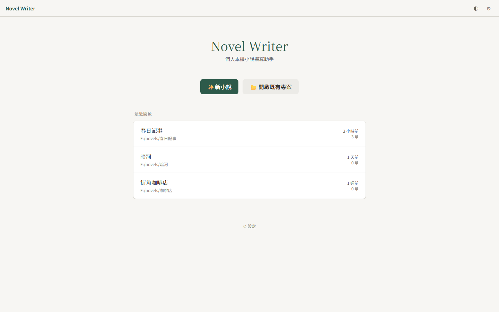

- 左側 App logo + tagline「個人本機小說撰寫助手」
- 主按鈕「+ 新小說」、次按鈕「📂 開啟既有專案」
- 右側「最近開啟」清單：春日記事 / 暗河 / 街角咖啡店

**點「春日記事」→ 進 Dashboard（Step 2）**

---

### Step 2 — 專案 Dashboard

畫面：`/p/spring-diary`

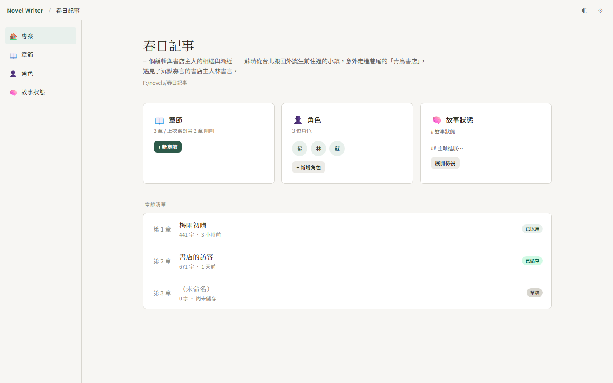

- 書名 + synopsis 大綱一段
- 三張統計卡：章節 / 角色 / 故事狀態
- 章節清單，三種 badge：
  - 🟣 已採用（第 1 章）
  - 🟢 已儲存（第 2 章）
  - ⚪ 草稿（第 3 章）

**點第 1 章「梅雨初晴」→ 進章節編輯器（Step 3）**

---

### Step 3 — 章節編輯器（乾淨狀態，單欄）

畫面：`/p/spring-diary/chapters/1`

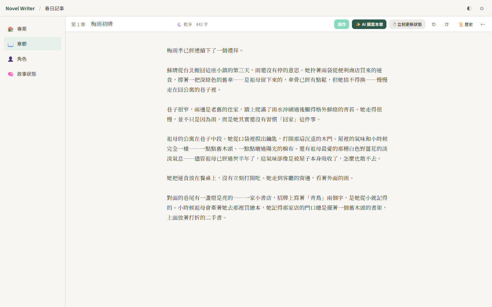

工具列（從左到右）：章節標題 / 儲存狀態 badge ⚪ / 字數 / 儲存 / ✨ AI 撰寫本章 / ⏱ 立刻更新狀態 / ⟲⟳ / 📜 歷史 / ← 返回

主編輯區：宋體 16px，max-width 720px 置中，第 1 章全文。

---

### Step 3b — 章節編輯器（AI 工作區展開 — 三欄）

點「✨ AI 撰寫本章」後展開三欄：

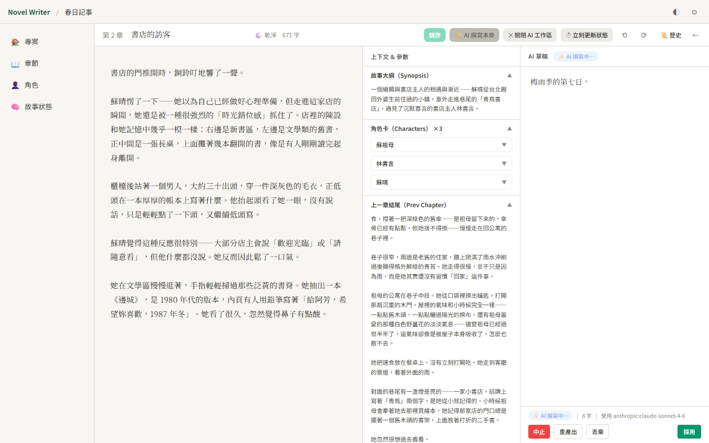

| 欄 | 內容 |
|---|---|
| **左：主編輯器** | 章節定稿（仍可編輯）|
| **中：上下文 & 參數** | synopsis / 角色卡 / 上一章結尾 / 故事狀態 / 寫作需求（可改）/ Qwen3 參數 |
| **右：AI 草稿** | 串流輸出（可直接手改）|

中欄讀取 IDB 的真實 seed 資料（蘇晴角色卡摘要、故事大綱、story_status 前段）。

---

### Step 4 — 章節編輯器（autosave 觸發 🔵 狀態）

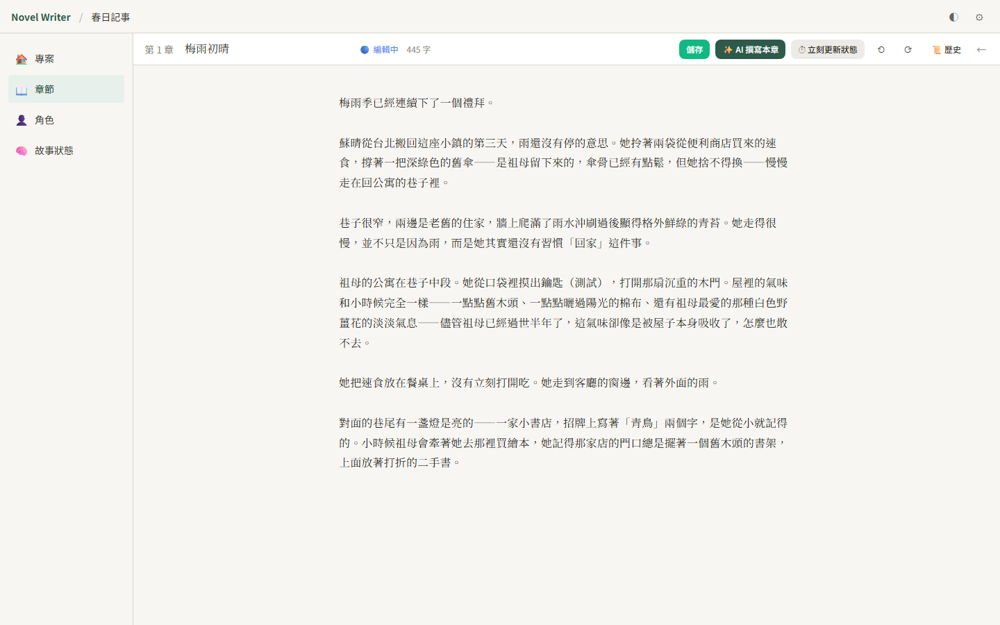

打字後 1.5 秒 debounce → 寫入 IndexedDB → badge 切成 🔵「編輯中」。

**驗收：F5 重整後內容還在（IndexedDB 持久化）**

---

### Step 5 — 未設定 LLM 引導 Modal

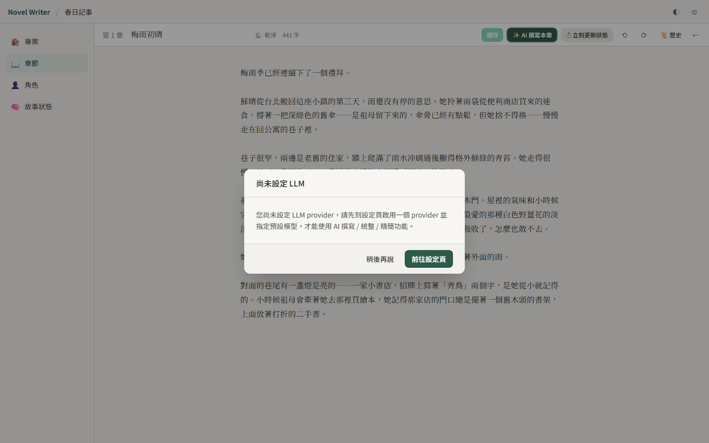

在任何 AI 按鈕（章節 / 角色卡 / 狀態），若設定頁 provider 全停用，跳此 modal。
兩按鈕：「前往設定頁」（主）/ 「稍後再說」（次）。

**點「前往設定頁」→ Step 6**

---

### Step 6 — 設定頁：Providers 全停用（初始狀態）

畫面：`/settings`

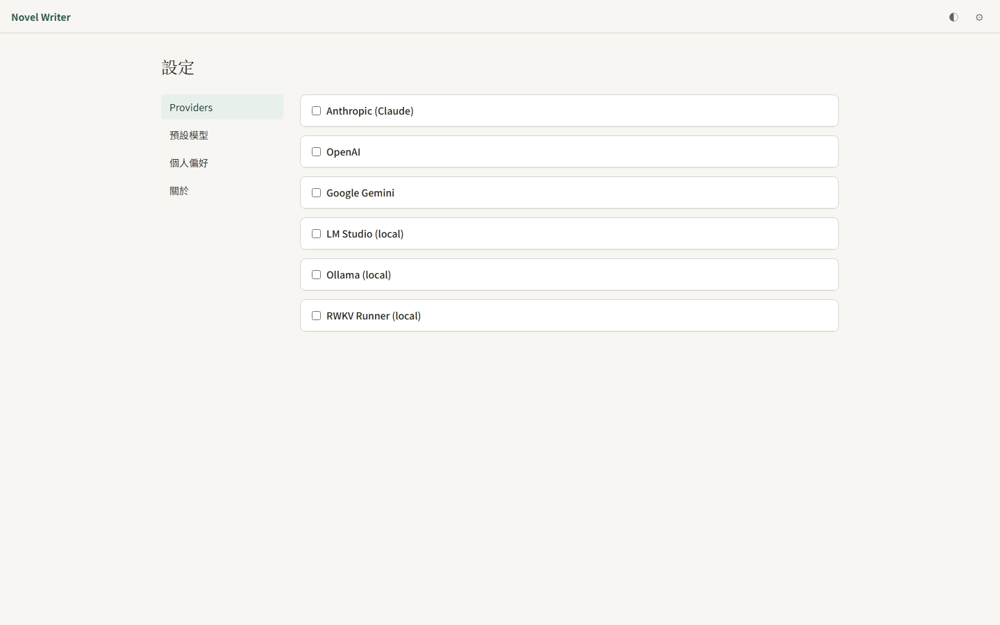

所有 provider 預設 disabled（per Story 009 設計，無 wizard）。

---

### Step 7 — 設定頁：Anthropic 啟用 + 測試連線成功

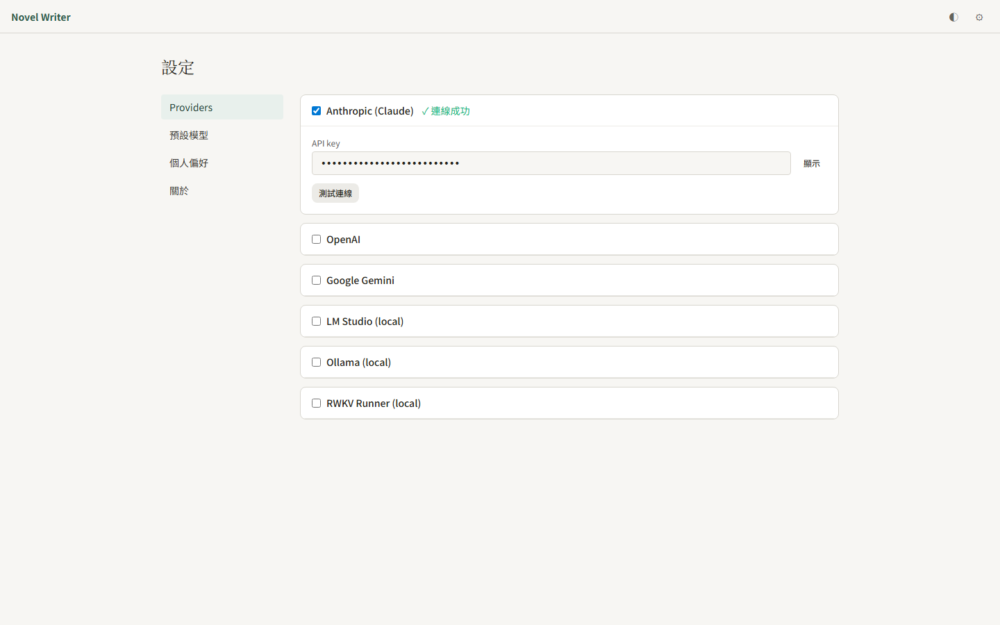

啟用 → 填入 API key → 測試連線 → 1 秒後綠勾「連線成功」。
之後 AI 按鈕不再跳「未設定」modal。

---

### Step 8 — 設定頁：預設模型 tab

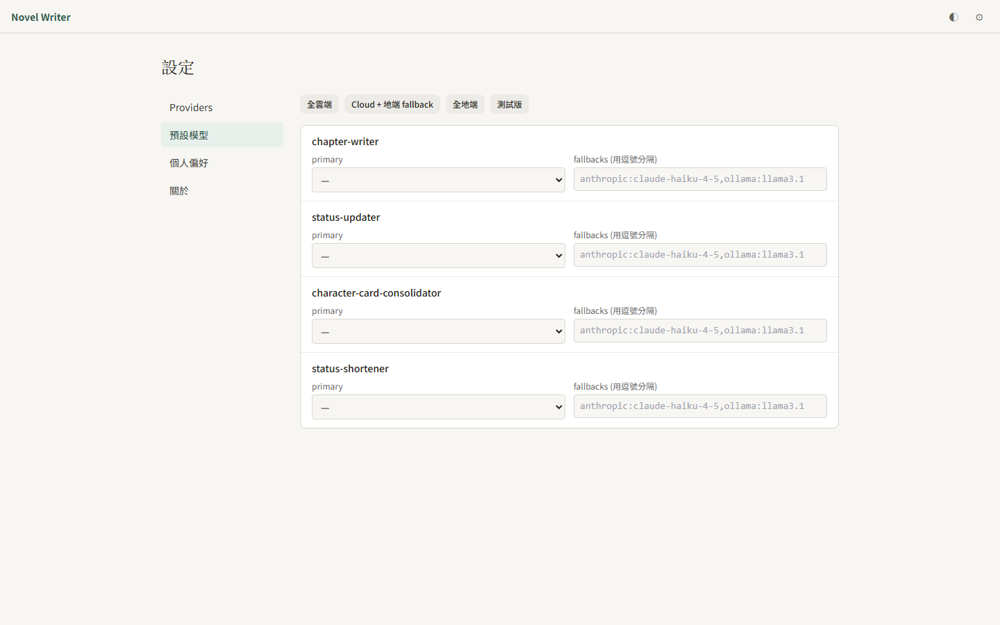

4 個 Agent 的 primary / fallbacks routing 設定。
Quick preset 按鈕（全雲端 / Cloud+地端 fallback / 全地端）一鍵填入。

---

### Step 9 — AI 撰寫：串流進行中（三欄）

畫面：`/p/spring-diary/chapters/2`

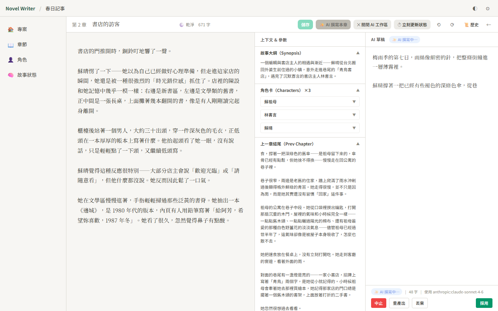

- 中欄：synopsis、角色卡、上一章結尾、寫作需求 textarea、Qwen3 參數
- 右欄：草稿 textarea 逐字串流（35ms/字），badge 藍色 pulse「✨ AI 撰寫中…」
- 主編輯器（左欄）**不被鎖定**，可同時繼續編輯定稿
- 串流期間可直接在草稿 textarea 打字插入

---

### Step 9c — 生成參數面板（Qwen3）

展開中欄「⚙ 生成參數（Qwen3）」accordion：

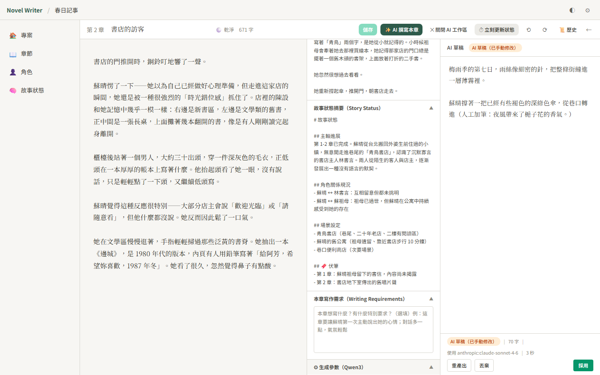

8 個可調參數，每個附說明文字：

| 參數 | 說明重點 |
|---|---|
| temperature | 創意程度，越高越多樣 |
| top_p | nucleus sampling 範圍 |
| top_k | 每次候選詞數量 |
| min_p | 最低機率門檻（Qwen3 特有） |
| repetition_penalty | 重複懲罰，避免文字打轉 |
| max_tokens | 最大輸出 token 數 |
| enable_thinking | Qwen3 思考模式開關 |
| thinking_budget | 思考 token 預算（thinking=on 才顯示） |

---

### Step 9d — 開啟 Thinking 模式

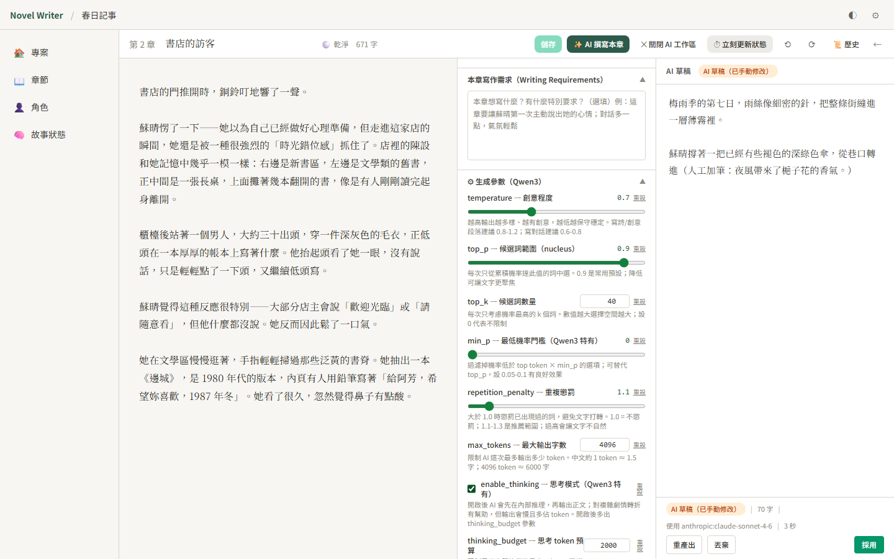

勾選「enable_thinking」→ 下方動態出現「thinking_budget」input（預設 2000 token）。

---

### Step 10 — 草稿可直接手改（已手動修改 badge）

串流完成或中止後，在右欄草稿 textarea 直接打字：

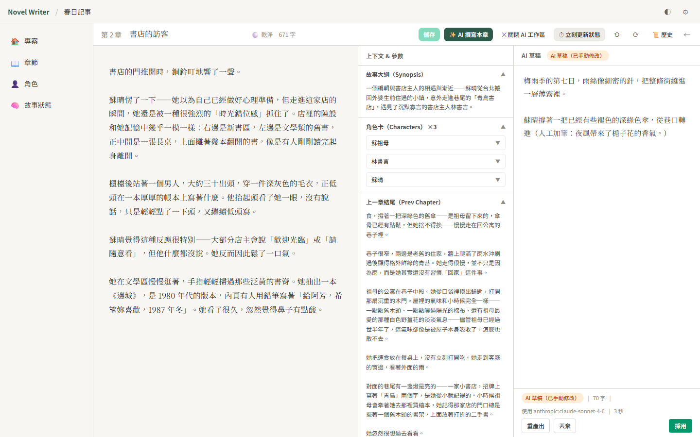

- badge 切成橘色「AI 草稿（已手動修改）」
- 字數即時更新
- 按「採用」時把**手改後的版本**寫回主檔（不管是否還是原始 AI 輸出）
- 底部顯示使用模型 + 字數 + 耗時

---

### Step 11 — 採用確認 Modal

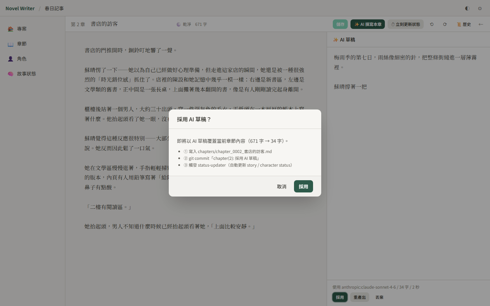

明確說明「系統會自動：① 寫入 .md ② git commit ③ 觸發 status-updater」。
確認後：三連 toast（已採用 → 已儲存 → 狀態更新中）。

---

### Step 12 — 歷史抽屜（章節）

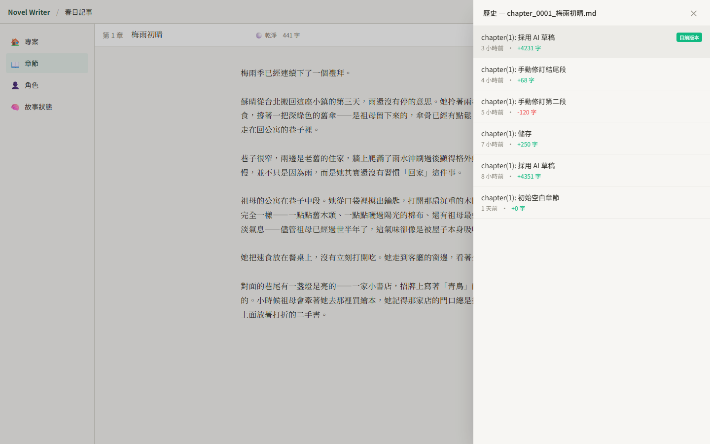

點任何編輯器的「📜 歷史」 → 右側抽屜滑入。  
清單顯示：commit message / 相對時間 / 字數變化 / 「目前版本」badge。

---

### Step 13 — 歷史抽屜：Preview 展開

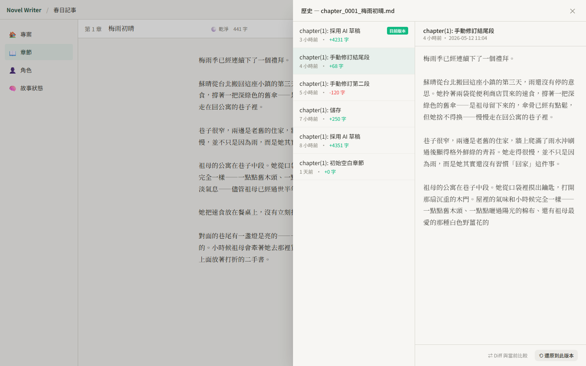

點任一歷史 commit → 右側展開（抽屜變寬）→ 顯示該版本內容（唯讀）。  
底部：「⟲ 還原到此版本」（需二次確認）/ 「⇄ Diff 與當前比較」（stub）。

---

### Step 14 — 角色卡列表

畫面：`/p/spring-diary/characters`

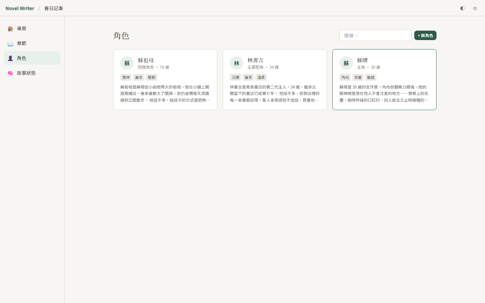

3 張角色卡（蘇晴 / 林書言 / 蘇祖母），顯示名稱 / 角色定位 / 個性標籤。

---

### Step 15 — 角色卡編輯（蘇晴）

畫面：`/p/spring-diary/characters/char-suqing`

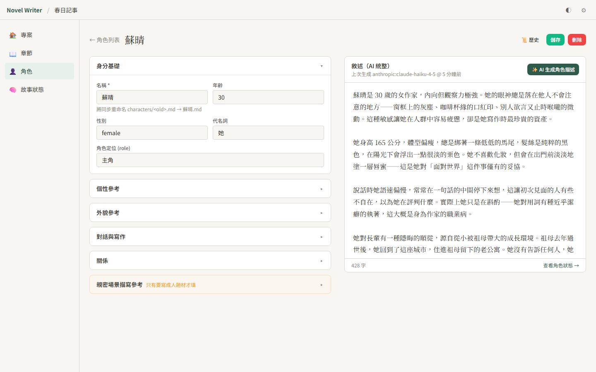

左半：6 個摺疊欄位區塊（身分基礎預設展開）  
右半：AI 生成的連貫敘述 textarea，下方標示模型 + 時間 + 手動編輯狀態  
v0.2 / v0.3 vision ghost button 預留位置（disabled）

---

### Step 16 — 角色卡：AI 生成中

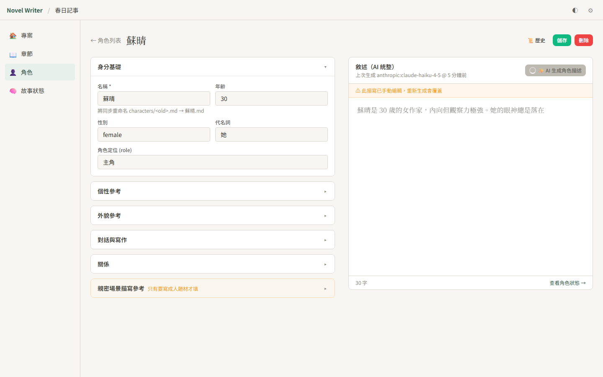

按「✨ AI 生成角色描述」→ 右側 textarea 逐字串流（30ms/字）。
生成期間按鈕顯示 spinner「生成中…」。

---

### Step 17 — 角色卡：AI 生成完成

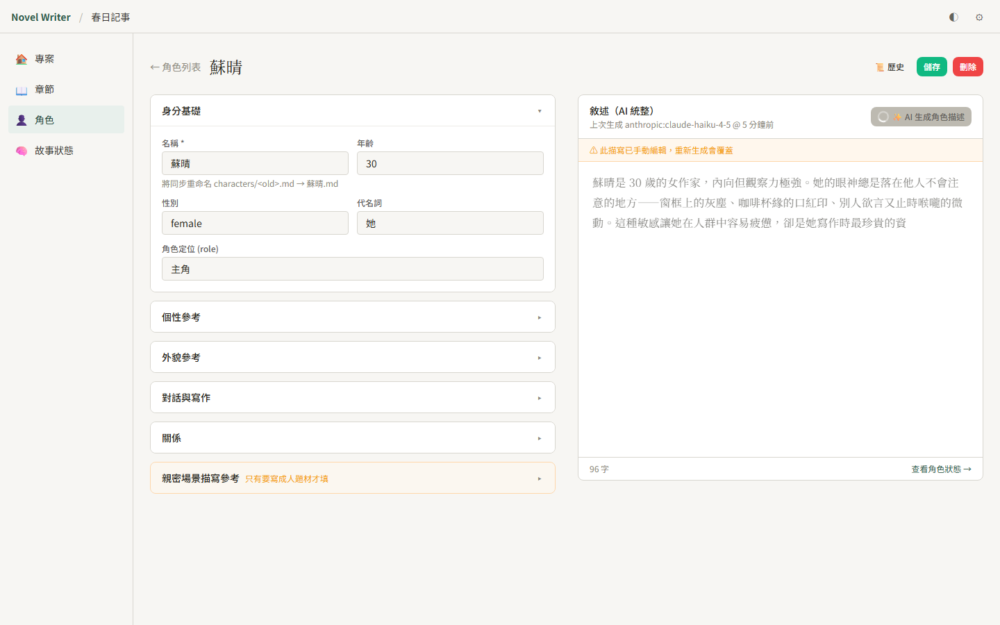

生成完成後：連貫敘述填入 textarea，下方更新「consolidatedAt / model」資訊。  
若手動修改任何字 → 橘色警示「此描寫已手動編輯，重新生成會覆蓋」。

---

### Step 18 — 故事狀態編輯器

畫面：`/p/spring-diary/status/story`

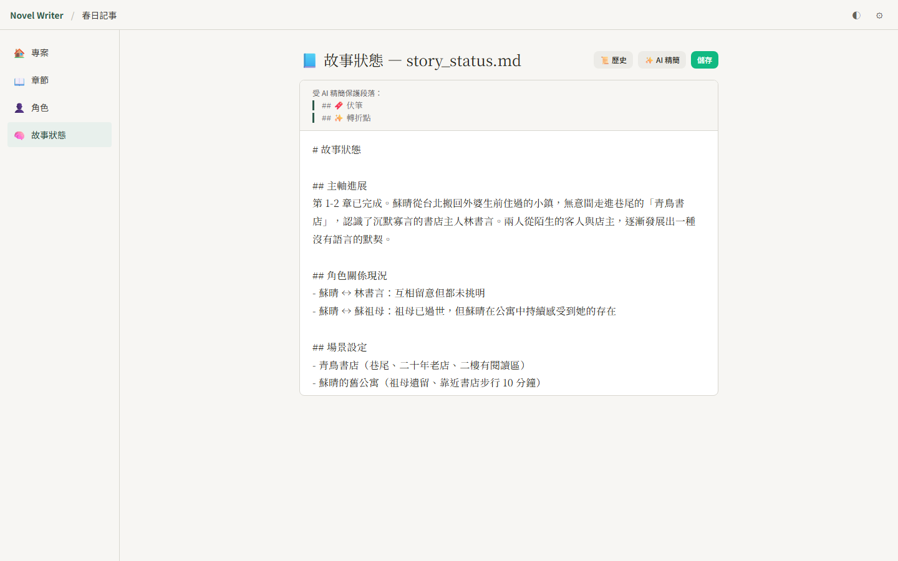

`story_status.md` 的 markdown 編輯區。  
🔖 伏筆 / ✨ 轉折點段落用左側彩色 bar 區分（受 AI 精簡保護）。  
Toolbar：儲存 / ✨ AI 精簡（slider modal）/ 📜 歷史。

---

### Step 19 — 角色狀態（蘇晴）

畫面：`/p/spring-diary/status/characters/char-suqing`

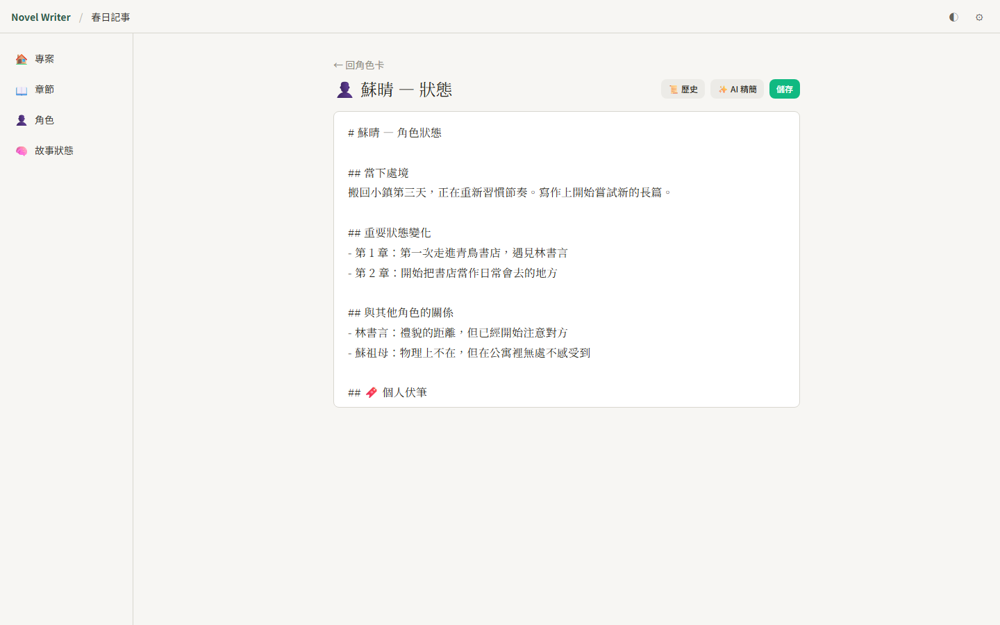

結構同故事狀態，標題改為「蘇晴 — 角色狀態」。  
上方「← 回角色卡」連結。

---

### Step 20 — 建立新小說

畫面：`/projects/new`

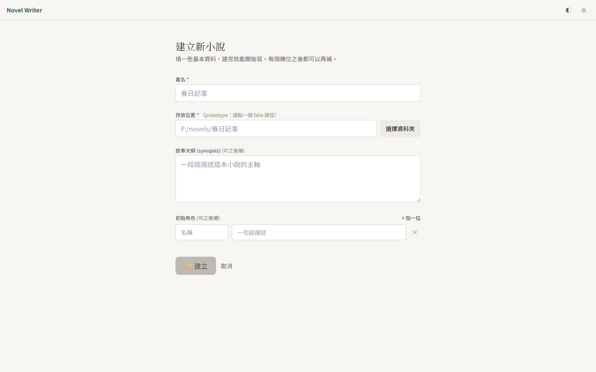

- 書名（必填）、存放路徑選擇器、故事大綱 textarea
- 初始角色可新增多個
- 必填欄缺項時「✨ 建立」disabled

---

### Step 21 — Dark Mode（章節編輯器）

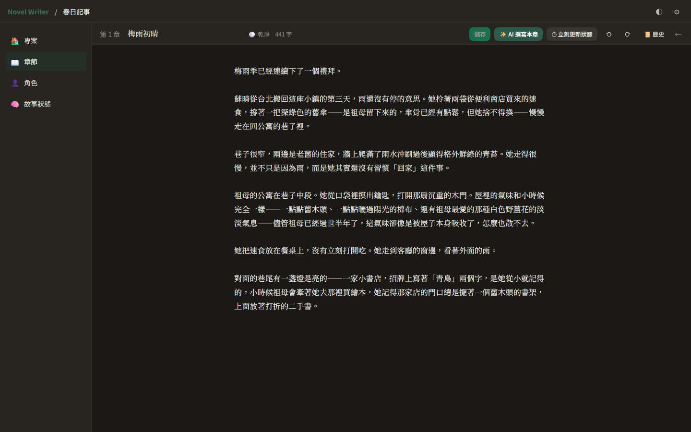

Top bar 右上「◐」切換 / 設定頁個人偏好 tab 也有。  
底色偏暖深色（非純黑），章節編輯區字色 `#e8e6e1`（非純白）。

---

### Step 22 — Dark Mode（首頁）

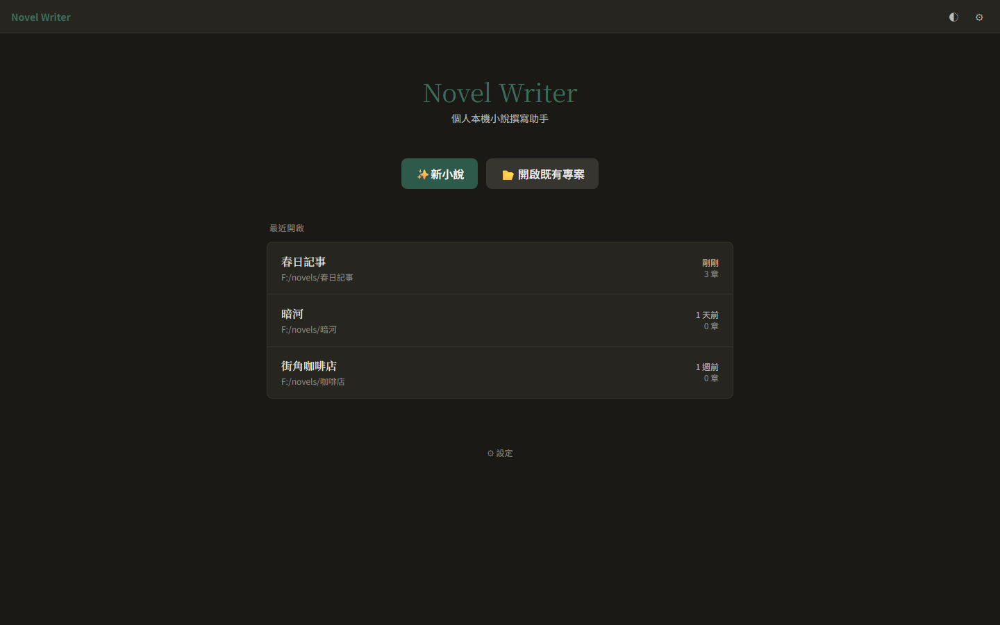

Dark mode 全站一致；切換後 localStorage 持久，F5 重整維持。

---

## 畫面索引

| # | 截圖 | 畫面 | Route | 對應 Story |
|---|---|---|---|---|
| 01 | [首頁](screenshots/01-home.png) | 首頁 + 最近專案 | `/` | 001, 008 |
| 02 | [Dashboard](screenshots/02-dashboard.png) | 專案 Dashboard | `/p/:slug` | 008 |
| 03 | [編輯器—乾淨](screenshots/03-chapter-editor-clean.png) | 章節編輯器 | `/p/:slug/chapters/:n` | 003, 004 |
| 04 | [編輯器—編輯中](screenshots/04-chapter-editor-dirty.png) | autosave 🔵 狀態 | `/p/:slug/chapters/:n` | 003 |
| 05 | [未設定 LLM](screenshots/05-llm-not-configured-modal.png) | 未設定 LLM Modal | （global） | 009 |
| 06 | [設定—停用](screenshots/06-settings-providers-disabled.png) | 設定頁（初始） | `/settings` | 009 |
| 07 | [設定—啟用](screenshots/07-settings-providers-enabled.png) | 設定頁（Anthropic 啟用） | `/settings` | 009 |
| 08 | [設定—模型](screenshots/08-settings-model-routing.png) | 預設模型 tab | `/settings` | 009 |
| 09 | [AI 串流中](screenshots/09-chapter-editor-streaming.png) | AI 草稿串流 | `/p/:slug/chapters/:n` | 005 |
| 10 | [AI 完成](screenshots/10-chapter-editor-ai-done.png) | AI 草稿完成 | `/p/:slug/chapters/:n` | 005, 006 |
| 11 | [採用確認](screenshots/11-adopt-confirm-modal.png) | 採用確認 Modal | （global） | 006 |
| 12 | [歷史抽屜](screenshots/12-history-drawer.png) | 歷史抽屜（列表） | （drawer） | 010 |
| 13 | [歷史—Preview](screenshots/13-history-drawer-preview.png) | 歷史抽屜（Preview） | （drawer） | 010 |
| 14 | [角色列表](screenshots/14-character-list.png) | 角色卡列表 | `/p/:slug/characters` | 002 |
| 15 | [角色編輯](screenshots/15-character-edit.png) | 角色卡編輯 | `/p/:slug/characters/:id` | 002 |
| 16 | [AI 生成中](screenshots/16-character-ai-generating.png) | 角色 AI 生成串流 | `/p/:slug/characters/:id` | 002 |
| 17 | [AI 生成完](screenshots/17-character-ai-done.png) | 角色 AI 生成完成 | `/p/:slug/characters/:id` | 002 |
| 18 | [故事狀態](screenshots/18-story-status.png) | 故事狀態編輯器 | `/p/:slug/status/story` | 007, 010 |
| 19 | [角色狀態](screenshots/19-character-status.png) | 角色狀態編輯器 | `/p/:slug/status/characters/:id` | 007, 010 |
| 20 | [建立專案](screenshots/20-project-new.png) | 建立新小說表單 | `/projects/new` | 001 |
| 03b | [三欄展開](screenshots/03b-chapter-editor-3col-open.png) | 章節編輯器 AI 工作區 | `/p/:slug/chapters/:n` | 003, 005 |
| 09b | [串流—三欄](screenshots/09b-chapter-editor-streaming-3col.png) | AI 串流（三欄） | `/p/:slug/chapters/:n` | 005 |
| 09c | [Qwen3 參數](screenshots/09c-params-panel-expanded.png) | 生成參數面板 | `/p/:slug/chapters/:n` | 005 |
| 09d | [Thinking 模式](screenshots/09d-params-thinking-enabled.png) | enable_thinking | `/p/:slug/chapters/:n` | 005 |
| 10b | [草稿手改](screenshots/10b-chapter-editor-draft-manually-edited.png) | 草稿手動修改 badge | `/p/:slug/chapters/:n` | 005, 006 |
| 21 | [Dark—章節](screenshots/21-dark-mode-chapter-editor.png) | Dark mode（章節） | `/p/:slug/chapters/:n` | — |
| 21b | [Dark—三欄](screenshots/21b-dark-mode-3col-chapter.png) | Dark mode（三欄 AI 工作區） | `/p/:slug/chapters/:n` | — |
| 22 | [Dark—首頁](screenshots/22-dark-mode-home.png) | Dark mode（首頁） | `/` | — |

---

## 故意 Stub 的部分（不是 bug）

| Stub | 原因 | 實作軌時的方案 |
|---|---|---|
| AI 撰寫 / 統整 / 精簡皆為 fake | prototype 無後端 | Phase C 接 `packages/llm-adapter` |
| Undo/Redo 視覺按鈕，只靠 textarea Ctrl+Z | Story 004「用 editor lib 內建即可」；prototype 沒接 CodeMirror / Tiptap | 實作軌換 editor lib 後即可 |
| Diff 視圖（「⇄ Diff 與當前比較」）disabled | unified diff renderer 工作量不小；prototype 有 preview 已足夠驗收 UX | Phase C 接 `diff` / `diff2html` |
| AI 精簡是本地 string trim，非真 LLM | 同 fake AI | Phase C 接 `status-shortener` Skill |
| 「開啟既有專案」picker 是 fake dialog | Prototype 無檔案系統 access | Phase C 接 Electron / Tauri file picker |
| 角色卡的 vision 按鈕 disabled（002b / 002c） | v0.2 defer | Phase C v0.2 時接 vision adapter |
| 設定頁的「測試連線」是 1 秒假延遲 | 無真 provider | Phase C 接真 API |
| 沒有真 git commit（歷史都是 seed data） | 無後端 / 無 simple-git | Phase C 接 `simple-git` |
| 建立新小說不產生真資料夾 | 無檔案系統 | Phase C 接後端 |
| 刪除章節 / 重命名章節 menu 項目存在但無動作 | 省工；prototype 驗主流程 | Phase C 補 |

---

## UX 開放問題（請使用者點過後回答）

回答方式：在這個檔案底下直接標記 ✅（OK）或 ❌（要改）+ 備註，或者跟我口頭說。

### 關於章節編輯器

- [ ] **Q1** 草稿側欄從右側滑入的寬度（約 480px）夠不夠？還是應該是全寬 split view（左主右草稿各 50%）？
- [ ] **Q2** 串流期間主編輯區灰色遮罩 + 不可編輯——OK？還是希望可以「一邊看 AI 寫一邊自己繼續改主稿」？
- [ ] **Q3** 採用後三連 toast（採用→儲存→狀態更新）體感如何？夠不夠清楚讓人知道「自動鏈式發生了三件事」？
- [ ] **Q4** 「⏱ 立刻更新狀態」按鈕在 toolbar 是否直覺？還是放在別的地方（例如 status 頁才有）？
- [ ] **Q5** ⚪/🔵/🟢 三種儲存狀態，位置在 toolbar、色彩區分是否夠清楚？還是需要文字說明（例「已 autosave / 已儲存」）？
- [ ] **Q6** AI 草稿側欄的「採用 / 丟棄 / 重產出」三按鈕等距並排，哪個最主要？「採用」要不要更大、「丟棄」要不要最弱化？

### 關於角色卡

- [ ] **Q7** 6 個欄位區塊（accordion 折疊）vs tabs——prefer 哪種？目前用 accordion，每個都可折疊，身分基礎預設展開。
- [ ] **Q8** 「✨ AI 生成角色描述」按鈕在左半欄位區下方——位置對嗎？還是放右半「敘述」區的上方？
- [ ] **Q9** 親密場景描寫區預設摺疊 + 灰色說明文字——這樣處理 OK？有沒有覺得不夠隱蔽或太明顯？
- [ ] **Q10** 角色卡的 v0.2 vision ghost button（上傳圖 / 文字生圖）預留位置——看起來是否有礙觀瞻？要不要徹底隱藏直到 v0.2？

### 關於故事 / 角色狀態

- [ ] **Q11** 🔖 / ✨ 段落用左側彩色 bar 視覺標示「受保護」——夠清楚嗎？有沒有需要加 tooltip 說明「AI 精簡不會動這段」？
- [ ] **Q12** AI 精簡 modal 的 slider（精簡目標）是否直覺？使用者看到 slider 會知道在調什麼嗎？
- [ ] **Q13** status 編輯器和章節編輯器的體驗幾乎一模一樣（都是 markdown textarea）——OK？還是 status 應該有更多輔助結構（例如強制顯示各段標題）？

### 關於設定頁

- [ ] **Q14** 設定頁的 Provider → 預設模型兩步流程（先啟用 provider 再設模型）是否感覺繁瑣？有沒有更快的 happy path？
- [ ] **Q15** Quick preset button（「全雲端」「Cloud + 地端 fallback」等）有幫助嗎？點了之後 dropdown 自動填入的反饋清楚嗎？
- [ ] **Q16** API key 遮蔽顯示（`sk-ant-...••••••1234`）+ 旁邊「顯示」按鈕——OK？還是覺得多餘？

### 關於歷史 / 還原

- [ ] **Q17** 歷史抽屜從右側滑入 + 展開（click commit 後更寬）—— 體感如何？覺得 OK 還是太複雜？
- [ ] **Q18** 「Diff 與當前比較」目前 disabled，你對 diff 視圖的需求程度？是「一定要有」還是「不急，先有還原就好」？
- [ ] **Q19** 「還原到此版本」需要二次確認（「將 chapter_0001 還原到 X 的版本，當前內容會被覆蓋」）——OK？還是要加「之後可再 undo」的說明？

### 關於整體導覽

- [ ] **Q20** Sidebar 常駐（章節 / 角色 / 狀態三個分類）—— OK？還是覺得佔空間，希望可以收合？
- [ ] **Q21** Top bar 的麵包屑（首頁 > 春日記事 > 第 1 章）清楚嗎？
- [ ] **Q22** Dark mode 整體感受如何？偏暖底色的深色是你期待的風格嗎？

---

## Phase C 決策前需要釐清的問題

以下不是 UX 問題，而是**實作前需要確認的設計決策**：

1. **章節大綱（outline）放哪**：目前 prototype 沒有 outline 欄位（story 005 要求讀 `_outline.md`）。實作前需決定：章節編輯器內折疊的「📋 本章大綱」textarea，還是 Dashboard 另開一頁？
2. **「新增章節」流程**：目前 Dashboard 有「+ 新章節」按鈕但無動作（stub）。問題：章節要先填標題才能建立，還是允許先建空白章節再填？
3. **Sidebar 章節清單的「目前章節」高亮**：章節清單在 sidebar，但 sidebar 目前的章節項目只是導覽 link，沒有「正在寫哪章」的全局高亮。實作時要確認這個 UX。
4. **status-updater 失敗的 UX**：採用後三連 toast 的第三個是「狀態更新中…」，但如果 LLM 失敗呢？要顯示「重試」按鈕，還是讓使用者去 status 頁手動觸發？
5. **串流中切換章節**：prototype 沒有實作「離開後回來草稿還在」。實作時確認：草稿 cache key 是 `projectSlug:chapter:N:draft`，和 autosave 的 key 分開，避免衝突。
6. **git author**：Story 010 open question 說 MVP 用固定 `novel-writer-app <noreply@local>`——這樣 OK？還是讓使用者在設定頁輸入名字？

---

> 驗收後，請把所有 Q 的答案告訴我，或直接在 Walkthrough 上標記。之後進入 Phase C：補 spec → 實作軌。
