# M4 UX Review — 自動截圖報告（v2）

> **本次更新**：使用 Playwright MCP 在 Chrome 中實際點擊互動，截圖共 16 張。
> **環境**：Windows 11 + Node v26.1.0 + dev mode（API 3001 / Web 5173）
> **截圖位置**：`docs/qa/ux-screenshots/`（同目錄，markdown preview 可正常顯示）
> **日期**：2026-05-14
> **如何使用**：每個 UI 表面下都有「**👤 你的 review**」區，請直接編輯填入意見。

---

## 🔴 本次新發現的嚴重 Bugs（先看）

### BUG-A：章節編輯器完全壞掉（P0）

從首頁點任何「最近開啟」進入編輯器後：
- 章節清單**永遠空白**（即使檔案系統有章節）
- 點「+ 新章節」**沒反應**
- Console 持續出現：`Failed to load resource: 404 (Not Found) /api/projects/c4609c4e10072ee5/chapters/`

**根因**：前端呼叫 `/chapters/`（帶 trailing slash）→ 後端 Hono route 不接受 trailing slash → 404
**影響**：**整個 web 端的章節編輯流程完全無法使用**
**對應**：M3 BDD 測試已發現的 BUG-01（trailing slash），實際影響超出預期

### BUG-B：LM Studio 測試連線錯誤訊息粗糙（P1）

連不到 LM Studio 時顯示「✗ fetch failed」（純技術訊息），對使用者沒有任何幫助。

**改善**：應顯示「無法連線到 http://localhost:1234，請確認 LM Studio Server 已啟動」

### BUG-C：表單欄位驗證沒有提示（P1）

NewProjectDialog 步驟 1 「下一步」disabled 但沒有 inline 錯誤訊息說明為什麼。使用者要靠猜。

---

## 跨頁觀察：Light/Dark 模式分裂（沿用上次發現，未修）

| 頁面 | 背景 |
|---|---|
| HomePage / SettingsPage / NewProjectDialog / ChapterEditorPage | **Light**（白底）|
| CharactersPage / CharacterEditor / StatusEditorPage | **Dark**（黑底）|

→ 對應 M4 任務：`pol-1`（design token 統一）

---

## A. Pages（5 個）

### A1. HomePage

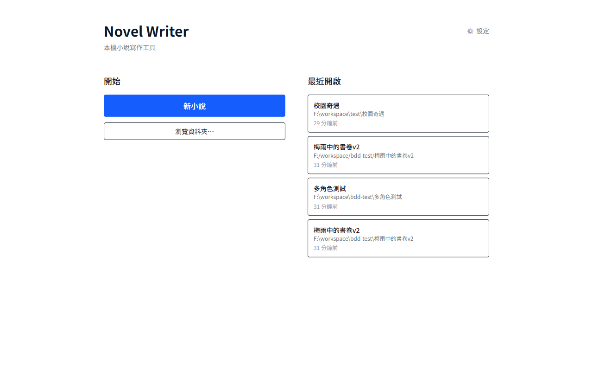

| 維度 | 評分 | 說明 |
|---|---|---|
| 功能性 | ✅ | Novel Writer 標題、新小說按鈕、瀏覽資料夾、最近開啟清單 |
| 視覺 | ⚠️ | Light 模式；「⚙️ 設定」在右上角，字小且灰色；最近清單卡片有 3 個重複（多角色測試 + 兩個梅雨 v2 因 path 斜線方向差異）|
| 互動 | ⚠️ | 卡片 hover 沒有明顯反饋 |
| 錯誤處理 | ✅ | 有空狀態提示 |

**Claude 改善建議**：
- 「設定」連結改更明顯（icon button）
- 處理重複專案問題（path normalize 不一致）
- 卡片 hover 加陰影/背景色

**👤 你的 review**：
> （請在此填寫你的意見，例如：是否同意這些建議？有沒有遺漏？優先序？）

---

### A2. ChapterEditorPage（無章節時）

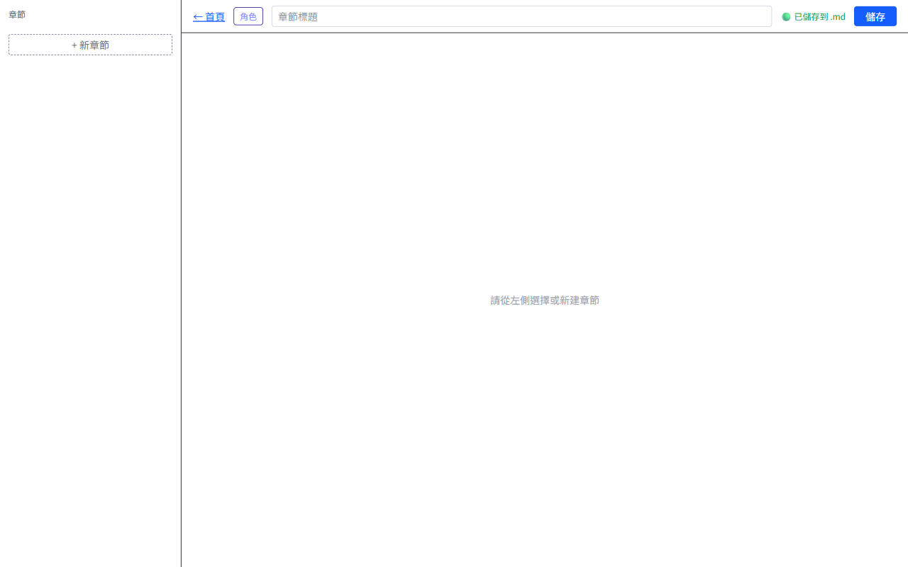

| 維度 | 評分 | 說明 |
|---|---|---|
| 功能性 | ⚠️ | 工具列正常（← 首頁、角色、章節標題、儲存）但只有空殼 |
| 視覺 | ⚠️ | Light 模式；「請從左側選擇或新建章節」中央提示文字顏色淡 |
| 互動 | ❌ | **新建專案後進入 = 永遠空白**（見 BUG-A）|

**👤 你的 review**：
> 

---

### A2b. ChapterEditorPage — BUG-A 實證

導入 `校園奇遇` 專案（檔案系統實際有 1 章），但 web 端章節清單仍**空白**。Console 5 個 404 錯誤。

**👤 你的 review**：
> 

---

### A2c. 點「+ 新章節」也失敗

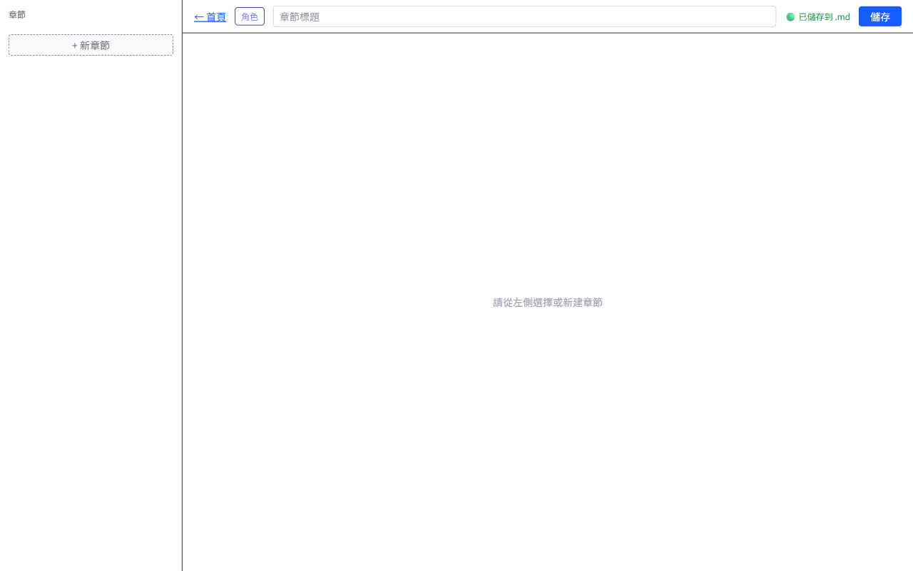

點「+ 新章節」沒任何反應，沒有錯誤訊息、沒有 toast、沒有新章節出現。**靜默失敗**最糟糕的 UX。

**👤 你的 review**：
> 

---

### A3. CharactersPage（無角色）

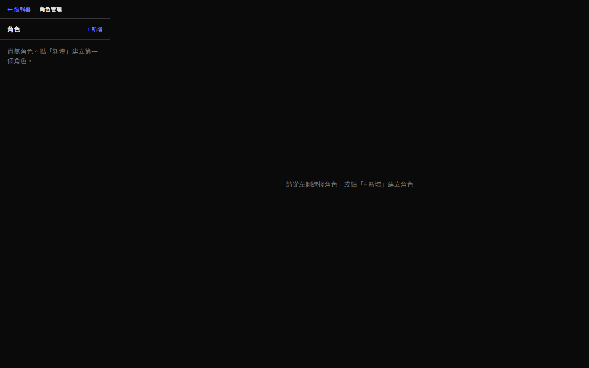

| 維度 | 評分 | 說明 |
|---|---|---|
| 功能性 | ✅ | 左欄角色清單、右欄空狀態提示 |
| 視覺 | ⚠️ | Dark 模式（與 HomePage Light 不一致）；左欄「尚無角色」文字擠在兩行 |
| 互動 | ✅ | 「+ 新增」可點 |

**Claude 改善建議**：
- 模式統一
- 左欄空狀態文字加大字級、加圖示

**👤 你的 review**：
> 

---

### A4. SettingsPage（折疊預設）

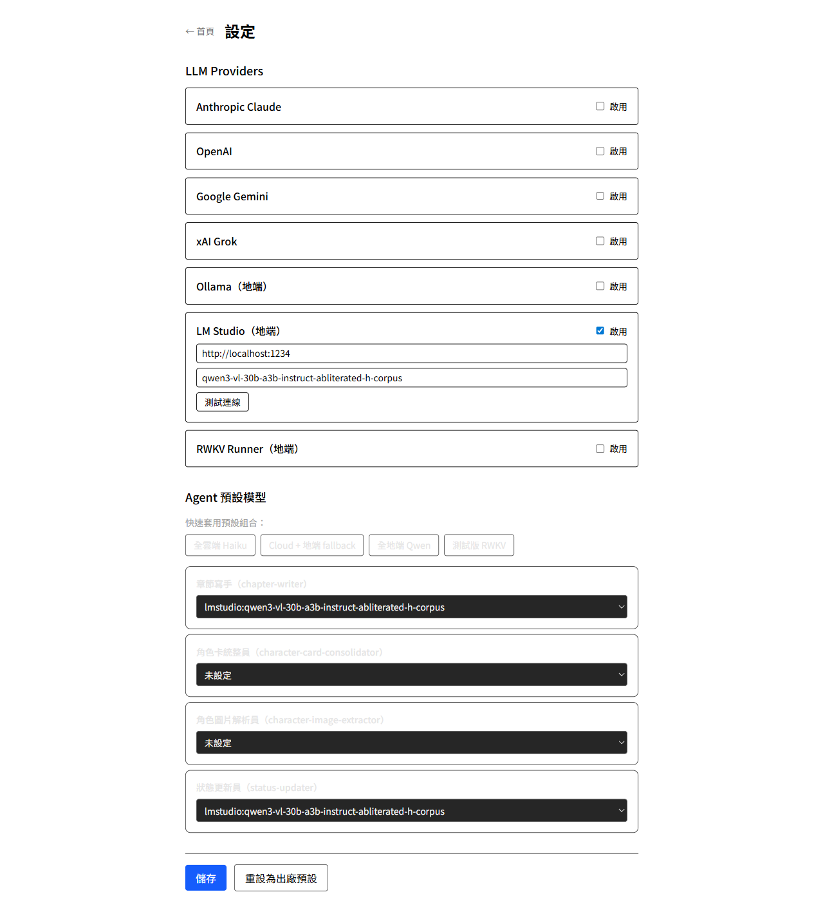

整頁完整截圖（fullPage）。

**👤 你的 review**：
> 

---

### A4b. 設定頁 — LM Studio 測試連線失敗

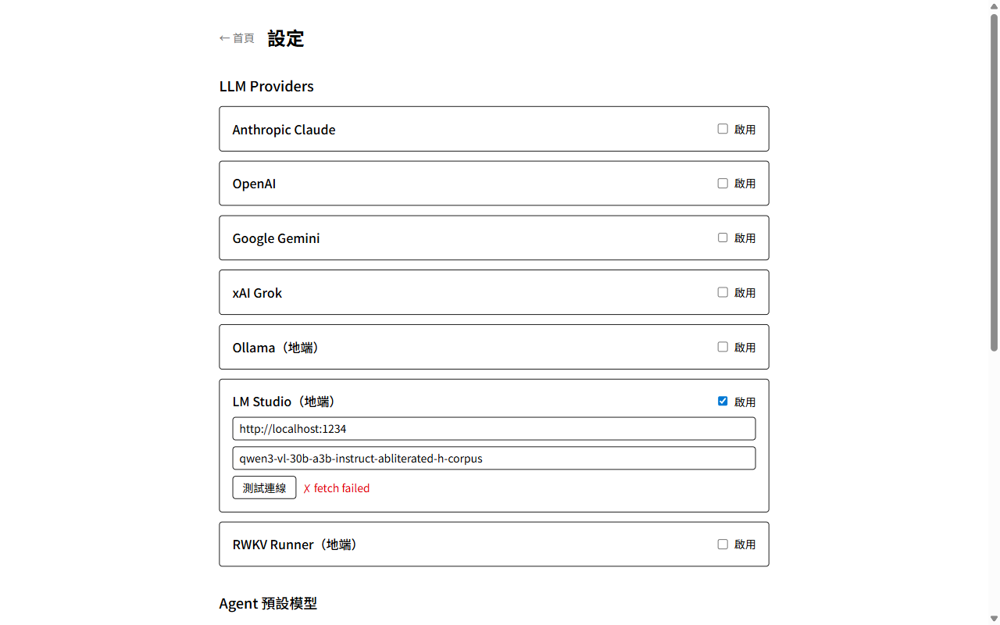

**BUG-B**：「✗ fetch failed」訊息對使用者無意義。

**Claude 改善建議**：
- 改為「✗ 無法連線到 endpoint，請確認 server 已啟動」
- 加 troubleshooting 連結（例如：開啟 LM Studio → Server tab → Start Server）

**👤 你的 review**：
> 

---

### A4c. 設定頁 — 完整滾動（fullPage）

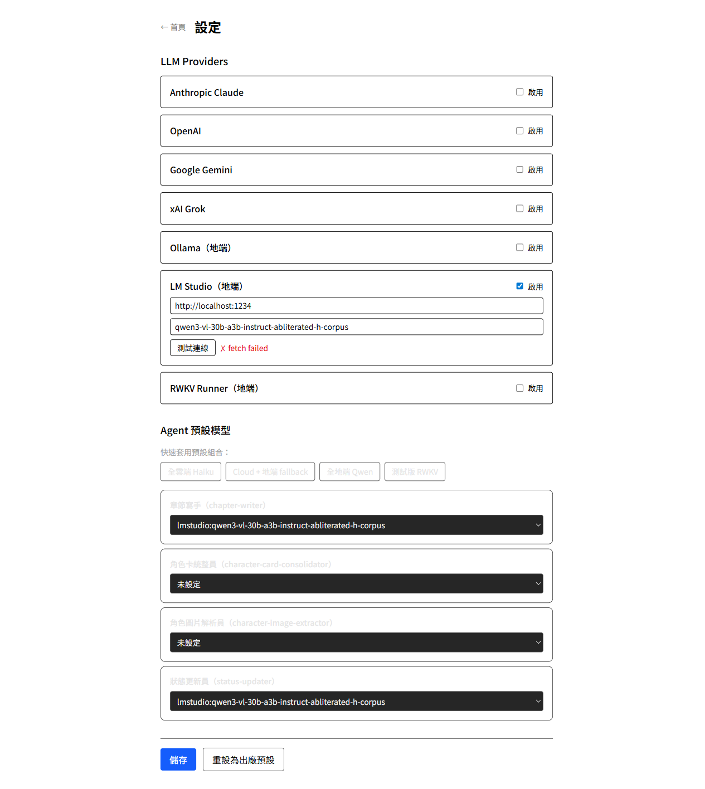

完整設定頁含 LLM Providers + Agent 預設模型 + 儲存按鈕。

| 觀察 | 說明 |
|---|---|
| Provider 卡片折疊 | Provider 預設折疊，只看到名稱+啟用 checkbox，**沒有展開指示**（▶ 或 ▼）|
| Provider 卡片展開 | 點 checkbox 啟用後才顯示 API key/endpoint 欄位（見 A4d）|
| Agent routing | 4 個 dropdown，未設定時無視覺警告 |
| Preset 按鈕 | 4 個 button 邊框細，視覺上不像主要操作 |

**👤 你的 review**：
> 

---

### A4d. 設定頁 — Provider 展開狀態

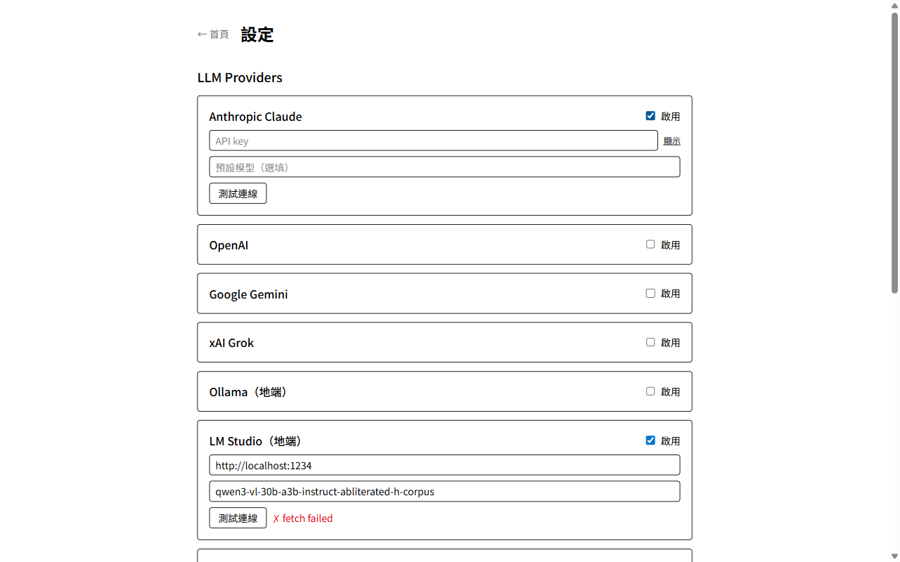

啟用 Anthropic Claude 後，卡片展開顯示 API Key、Endpoint、預設模型欄位。

**👤 你的 review**：
> 

---

### A5. StatusEditorPage

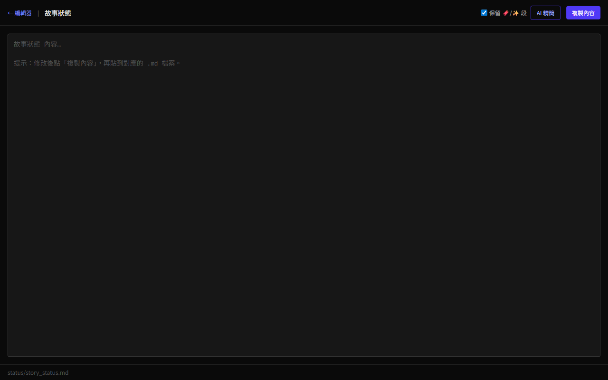

| 維度 | 評分 | 說明 |
|---|---|---|
| 功能性 | ❌ | **「複製內容」而非「儲存」**（M3 遺留 pol-9 未完）|
| 視覺 | ⚠️ | Dark 模式；底部 file path 字極小；「保留 🔖/✨ 段」checkbox 旁的 emoji 渲染怪 |
| 互動 | ❌ | 沒有「直接寫到 .md」的選項，使用者必須複製貼上 |
| 錯誤處理 | ⚠️ | 空專案讀不到 story_status.md 時只顯示 placeholder |

**Claude 改善建議（P0）**：
- 加 `POST /api/projects/:hash/status/write` endpoint
- 「複製內容」改名為「儲存」直接寫檔
- 「保留🔖/✨」用 icon 取代 emoji 提升渲染穩定度

**👤 你的 review**：
> 

---

## B. MainPanels（6 個）

### B5. CharacterEditor — 身分 tab

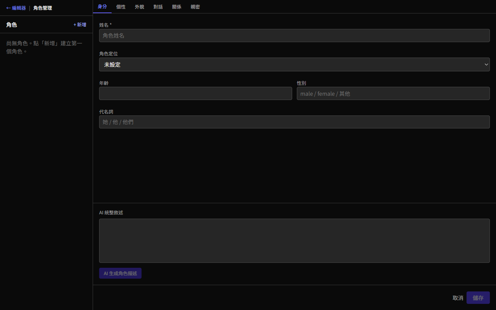

| 維度 | 評分 | 說明 |
|---|---|---|
| 功能性 | ✅ | 6 個 tabs（身分/個性/外貌/對話/關係/親密）、姓名（必填）、角色定位、年齡、性別、代名詞 |
| 視覺 | ⚠️ | AI 統整敘述區固定佔下方 ~25% 螢幕高度，新角色時無法折疊 |
| 互動 | ⚠️ | 「AI 生成角色描述」按鈕 disabled（新角色未儲存），無 tooltip 解釋；姓名空白時「儲存」disabled，無 inline 錯誤 |

**Claude 改善建議**：
- AI 統整敘述區可折疊
- disabled 按鈕加 tooltip

**👤 你的 review**：
> 

---

### B5b. CharacterEditor — 個性 tab

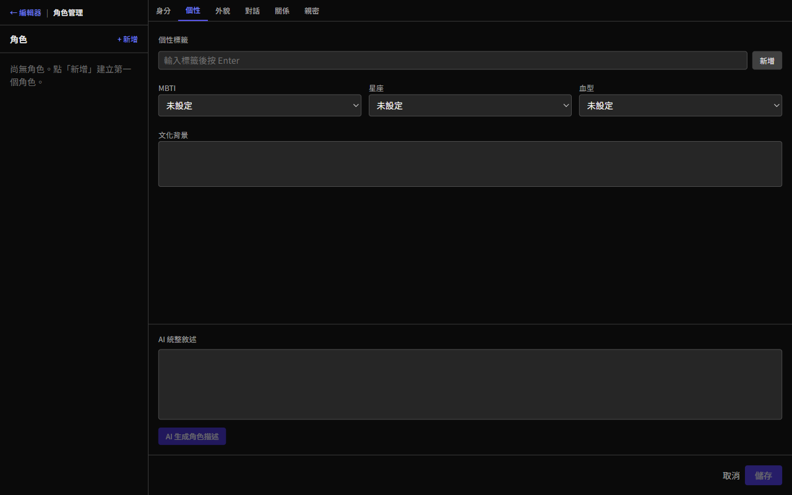

個性標籤輸入框（按 Enter 新增） + MBTI/星座/血型 dropdown + 文化背景 textarea。

**👤 你的 review**：
> 

---

### B5c. CharacterEditor — 外貌 tab

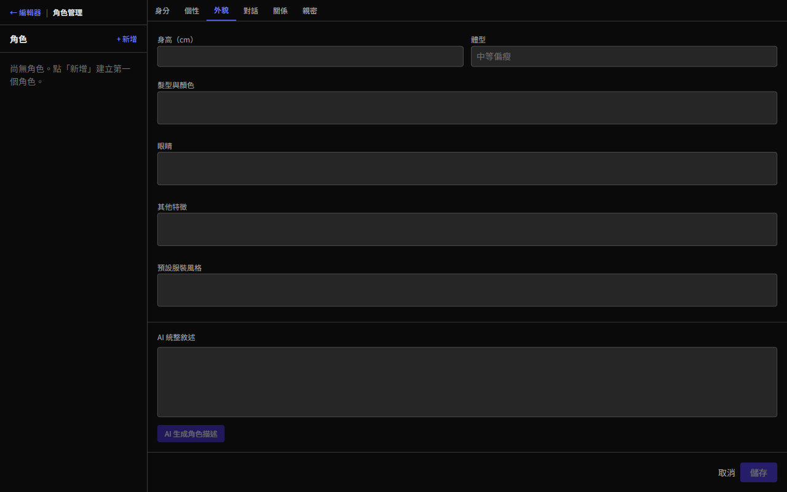

身高、體型、髮型、眼睛、其他特徵欄位 + 圖片上傳區。

**👤 你的 review**：
> 

---

### B5d. CharacterEditor — 親密 tab（預設摺疊）

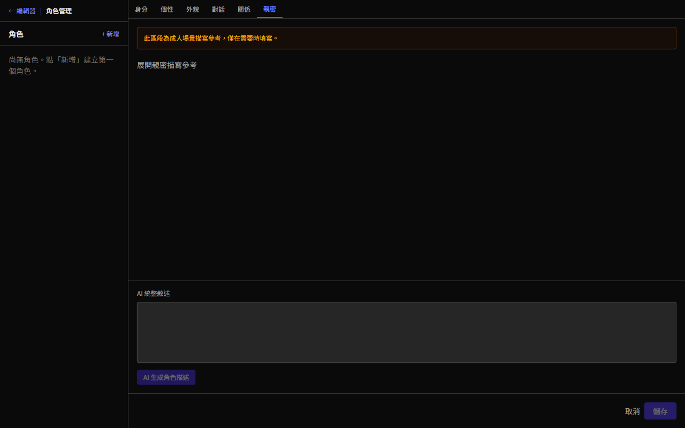

| 維度 | 評分 | 說明 |
|---|---|---|
| 功能性 | ✅ | 預設摺疊（spec 002 2.9 符合）|
| 視覺 | ⚠️ | 摺疊狀態下沒有任何提示，使用者不知道有內容可填 |

**Claude 改善建議**：
- 摺疊狀態加「展開」按鈕或一句說明（「點此展開親密場景描寫」）

**👤 你的 review**：
> 

---

### B1/B2/B3/B4/B6 因 BUG-A 無法截圖

由於章節編輯器完全壞掉（章節清單空、新增無效），以下面板無法在當前環境截圖：

- **B1 ChapterList** — 永遠空白
- **B2 ChapterEditor (CM6)** — 無章節可載入
- **B3 DraftPanel** — 需要 AI（且需要章節已選取）
- **B4 CharacterPanel** — 已在 A3 截到
- **B6 HistoryPanel** — 「歷史」按鈕只在選取章節後出現

→ **修復 BUG-A 後重做**

**👤 你的 review**：
> 

---

## C. Dialogs / Modals（7 個）

### C1. NewProjectDialog — 步驟 1（空白）

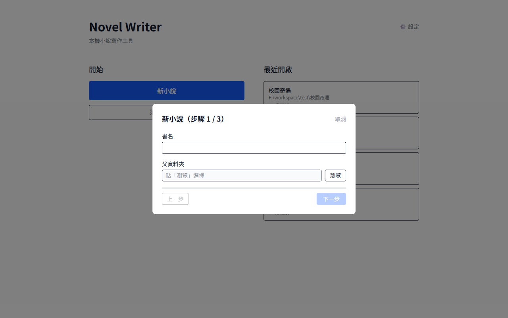

| 維度 | 評分 | 說明 |
|---|---|---|
| 功能性 | ✅ | 3 步驟 wizard，書名 + 父資料夾 |
| 視覺 | ⚠️ | Light dialog；Dialog 偏小，下半空白多 |
| 互動 | ⚠️ | 「下一步」disabled 沒有 inline 錯誤；「上一步」也 disabled 但邏輯正確 |
| 錯誤處理 | ❌ | **BUG-C** — 為何 disabled 無提示 |

**👤 你的 review**：
> 

---

### C1b. NewProjectDialog — 步驟 1（已填書名，父資料夾空）

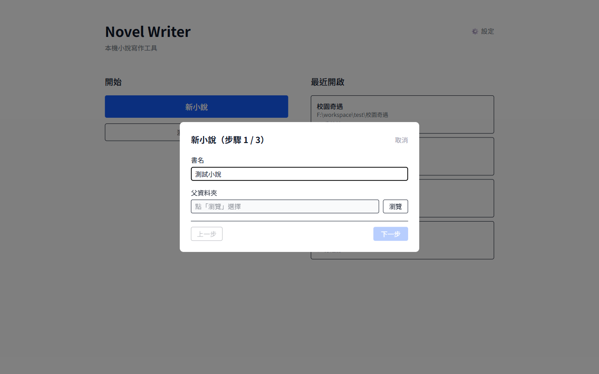

填了書名「測試小說」後，「下一步」仍 disabled（因為父資料夾未填）。**沒有任何視覺提示告訴使用者「還需要選父資料夾」。**

**Claude 改善建議**：
- disabled 按鈕加 tooltip 列出未填欄位
- 或：在欄位下方紅字提示「必填」

**👤 你的 review**：
> 

---

### C2~C7 待補

以下需要特殊觸發條件，本次未截到：

| Dialog | 觸發條件 | 狀態 |
|---|---|---|
| C2 ConflictDialog | mtime 不符 | 待補（手動製造 .md 外部變動） |
| C3 MissingProjectDialog | 最近清單中專案資料夾被刪 | 待補 |
| C4 FirstLaunchWarningDialog | meta.firstLaunchWarningAcknowledged=false | 待補（重置 settings） |
| C5 GitMissingDialog | git 未安裝 | 環境條件限制 |
| C6 LlmNotConfiguredModal | routing 未設定 + 點 AI 按鈕 | 因 BUG-A 無法觸發 |
| C7 AdoptConfirmDialog | 有 AI 草稿 + 點採用 | 需 LM Studio |

**👤 你的 review**：
> 

---

## D. Flows（3 個）

### D1. 採用草稿 11 步事務

🚫 需 LM Studio + 章節編輯器修復（BUG-A）

### D2. 章節載入衝突偵測

🚫 需製造 mtime 衝突

### D3. Window Focus 重檢

🚫 需手動切換視窗

**👤 你的 review（整段 Flows）**：
> 

---

## 整體觀察

### 🔴 P0 必修

1. **BUG-A：章節編輯器壞掉**（trailing slash → 404）
   - 是 M3 BUG-01 的實際影響，比想像中嚴重
   - 修法：Hono route 接受帶/不帶 trailing slash
2. **A5 StatusEditorPage 缺直接儲存**（M3 遺留 pol-9）

### ⚠️ P1 重要

3. **Light/Dark 模式分裂**（pol-1）
4. **BUG-B：LM Studio 錯誤訊息粗糙**（"fetch failed"）
5. **BUG-C：表單欄位 disabled 無提示**
6. **Provider 卡片無折疊指示符**
7. **Agent routing 未設定無視覺警告**
8. **「+ 新章節」失敗無提示**（靜默失敗）

### 💡 P2 拋光

9. AI 統整敘述區可折疊
10. disabled 按鈕加 tooltip
11. emoji 改 icon（StatusEditor checkbox）

---

## 對應 M4 任務匯總

| 改善項目 | 對應任務 | 優先級 |
|---|---|---|
| BUG-A trailing slash → 404 | fix-route-01（新增）| **P0** |
| StatusEditorPage 直接儲存 | pol-9（stat-fe-5）| **P0** |
| Light/Dark 模式不一致 | pol-1 | P1 |
| LM Studio 錯誤訊息友善化 | new-on-5 | P1 |
| 表單 disabled 加 tooltip | pol-6 | P1 |
| Provider card 折疊指示 | pol-1 | P1 |
| Agent routing 未設定警告 | on-4 | P1 |
| 「+ 新章節」失敗 toast | pol-6 | P1 |
| AI 統整敘述區可折疊 | pol-5 | P2 |
| 親密 tab 摺疊提示 | pol-5 | P2 |

---

## 完成狀態

| 區塊 | 已截圖 | 待補（修 BUG-A 後）|
|---|---|---|
| A. Pages | 5/5（A1/A2/A3/A4/A5）+ 4 補充截圖 | — |
| B. MainPanels | 4/6（B5 系列）| B1/B2/B3/B6（卡在 BUG-A）|
| C. Dialogs | 2/7（C1 + C1b）| C2~C7（需特殊觸發）|
| D. Flows | 0/3 | D1~D3（需 LM Studio + 觸發）|
| **總截圖** | **16 張**（vs 上次 20 張，本次因 BUG-A 少了 4 張）| — |

> **下一步**：修 BUG-A（trailing slash 404）後，B1/B2/B3/B6 才能截圖。建議優先處理。
